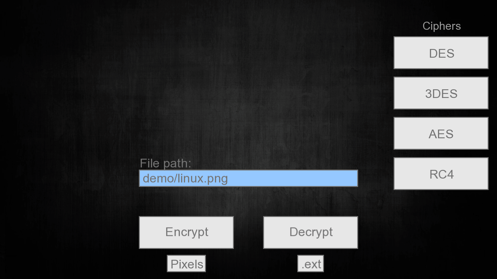

# Block-and-Stream-ciphers (June 2017)
Bachelor's thesis project. Implemented AES, DES, 3DES and RC4 ciphers, as well as ECB and CBC operation modes. UI was made from scratch. Developed in C++ with SFML. Rebuilt in August 2019 with SFML 2.5.1.

## Project Description

On the right side, there are the four ciphers implemented. In the middle, there is text field to point to the file which will be encrypted and just below it are the two main functions: Encrypt and Decrypt. Below the encrypt button, there is a button named "Pixels", which when is selected, the encrypt and decrypt functions will read the input as an array of pixels instead of bytes. To use this button only makes sense in the context of encrypting and decrypting images because they are represented as pixels. The reason for this button was to highlight the difference between encrypting with ECB operation mode and encrypting with CBC operation mode. ".ext" button, is a helper button, in the sense that it adds additional extensions to the encrypted or decrypted file (such as being encrypted with a certain cipher and certain operation modes)

Below we encrypt image linux.png with AES cipher. At first we encrypt it with ECB operation mode, and we can still see the linux's logo silhouette, but when we encrypt it with CBC (which is strictly superior to ECB mode), there are no longer any traces of the original image.

And an example on textfiles and its contents: Encrypting the message within a text file. In the video below, it is shown the contents after the encryption and the contents after the encryption (notice that after the encryption we can see three NULLS after the decrypted text, this is normal and it is because of the padding done by encryption because the ciphers works in blocks of equal size, hence the padding)

