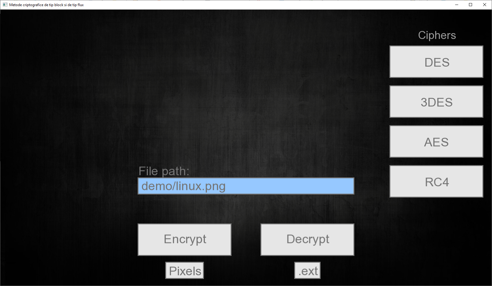

# Block-and-Stream-ciphers (June 2017)
Bachelor's thesis project. Implemented AES, DES, 3DES and RC4 ciphers, as well as ECB and CBC operation modes. Developed in C++ with SFML. Rebuilt in August 2019 with SFML 2.5.1.

## Project Description

## Usage
